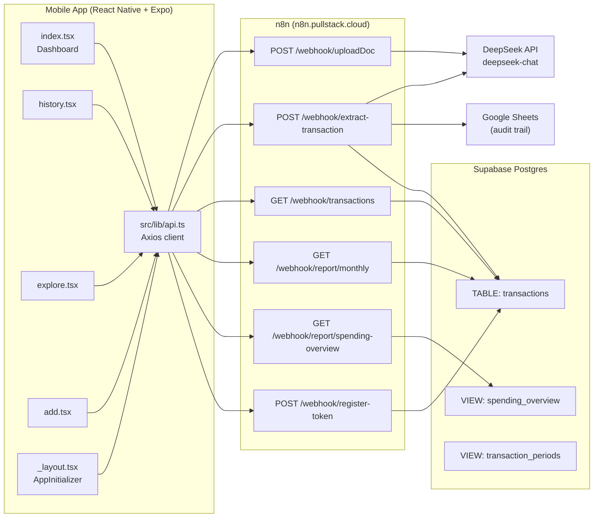
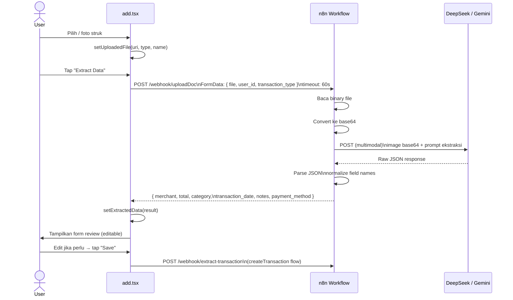
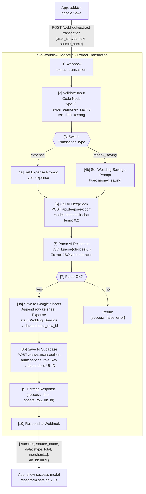
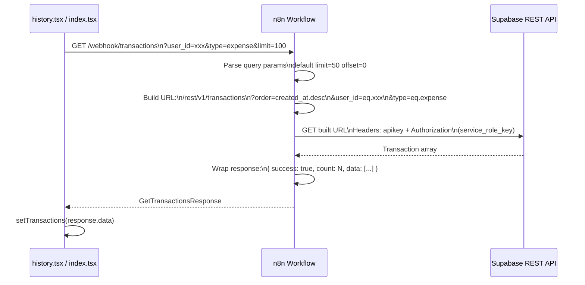
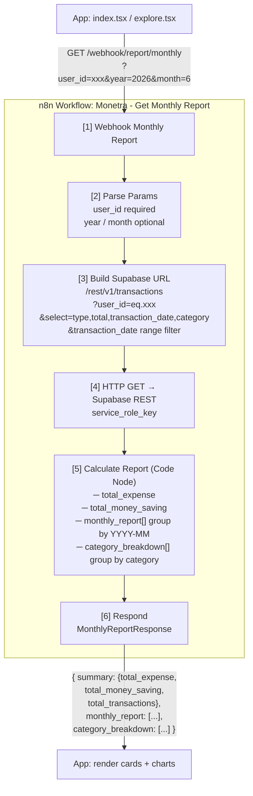
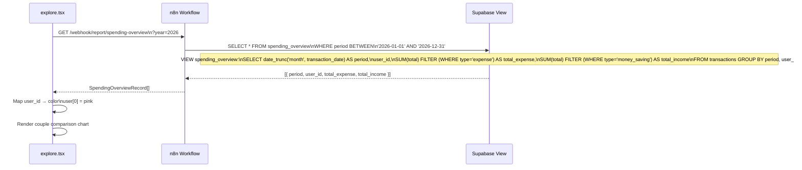
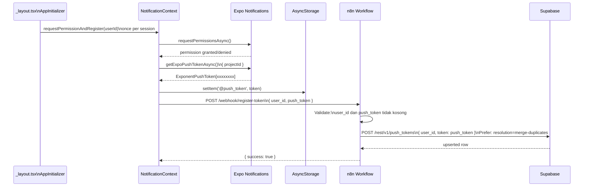
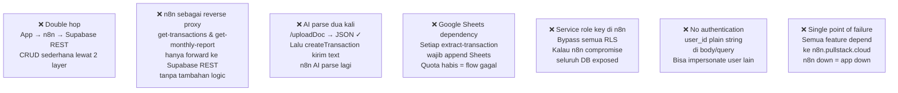
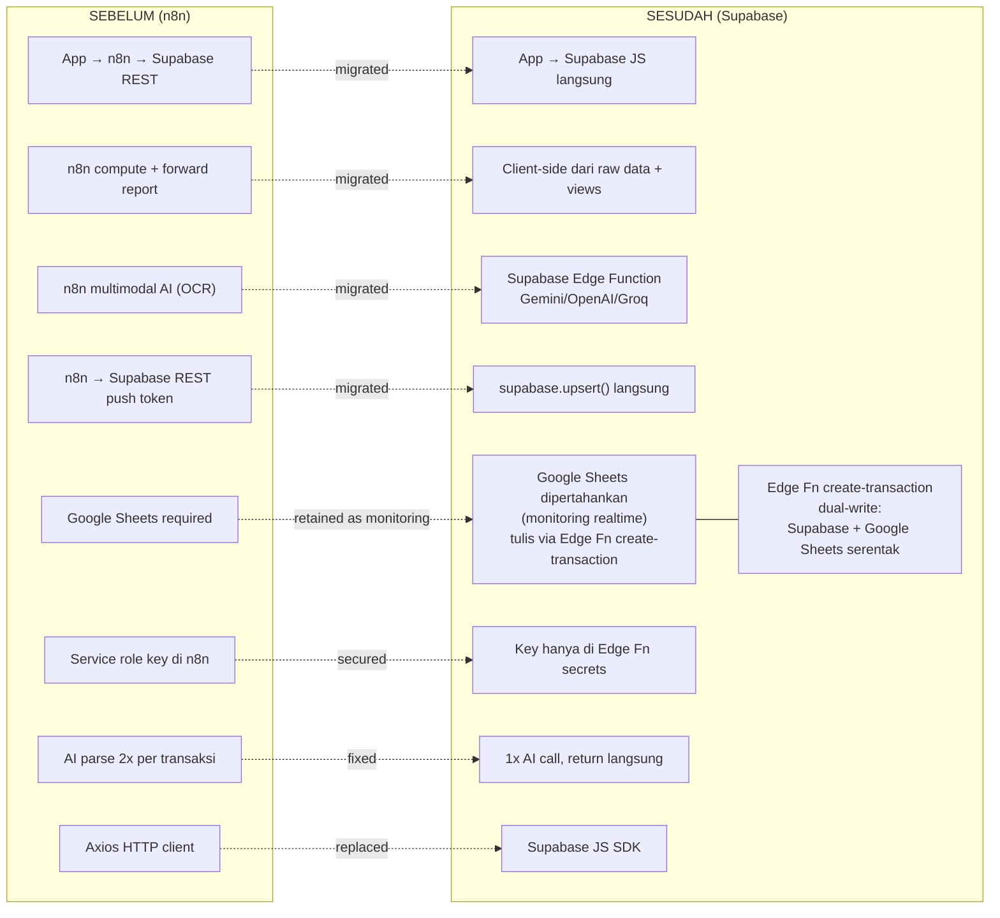

# Monetra — System Flow SEBELUM Migrasi ke Supabase

**Status:** Arsitektur lama (referensi). Digantikan oleh migrasi Supabase — lihat [2026-06-05-supabase-migration.md](../superpowers/plans/2026-06-05-supabase-migration.md).

> **Catatan migrasi:** Google Sheets **dipertahankan** sebagai realtime monitoring dashboard. Pada arsitektur baru, save transaksi lewat Edge Function `create-transaction` yang dual-write ke Supabase Postgres + Google Sheets secara bersamaan.

**Stack lama:** React Native App → Axios → n8n Webhooks → Supabase REST API / Google Sheets / DeepSeek AI

---

## 1. Overview Arsitektur

---

## 2. Upload & OCR Flow

**Endpoint:** `POST /webhook/uploadDoc`

---

## 3. Extract & Save Transaction Flow

**Endpoint:** `POST /webhook/extract-transaction`

---

## 4. Get Transactions Flow

**Endpoint:** `GET /webhook/transactions`

---

## 5. Monthly Report Flow

**Endpoint:** `GET /webhook/report/monthly`

---

## 6. Spending Overview Flow

**Endpoint:** `GET /webhook/report/spending-overview`

---

## 7. Register Push Token Flow

**Endpoint:** `POST /webhook/register-token`

---

## 8. Semua Endpoint n8n

| Endpoint | Method | Input | Output | Storage |
|---|---|---|---|---|
| `/webhook/uploadDoc` | POST | `FormData(file, user_id, transaction_type)` | `ExtractedTransactionData` | — stateless |
| `/webhook/extract-transaction` | POST | `{user_id, type, text, source_name}` | `{success, data, db_id}` | Google Sheets + Supabase |
| `/webhook/transactions` | GET | `?user_id&type&limit&offset` | `{success, count, data[]}` | Read Supabase |
| `/webhook/report/monthly` | GET | `?user_id&year&month` | `MonthlyReportResponse` | Read Supabase |
| `/webhook/report/spending-overview` | GET | `?year&month` | `SpendingOverviewRecord[]` | Read Supabase view |
| `/webhook/register-token` | POST | `{user_id, push_token}` | `{success}` | Upsert Supabase |

---

## 9. Masalah Arsitektur Lama

---

## 10. Sebelum vs Sesudah Migrasi

